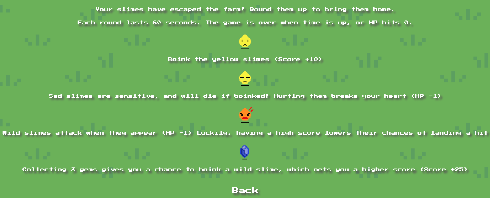

# <a href="https://akjw.github.io/Slime-Farm/" target="_blank">Slime Farm</a>
SEI-23 Project 1

- VanillaJS, HTML, CSS
- Sprites drawn in Piskel
- Theme & sound effects written with Magical 8 Bit Plug
- Background image sourced from <a href="http://pixelartmaker.com/art/6a68c9aee6a3655" target="_blank">pxielartmaker</a>

## MVP 

- Game principles based on whack-a-mole
- Basic grid layout
- Representative image for mole appears 1) at a randomized cell 2) for a randomized interval
- Mole disappears when clicked

## Furthers

- Distractor mole (i.e. should not be clicked)
- Mole that attacks player when spawned 
- Gradated difficulty levels
- Sprites that are animated to pop out of the ground (to replace static images)
- Sound effects when mole is hit / when player health is deducted 

## Gameplay overview

### Level design

- Grid is drawn everytime the game starts/restarts according to chosen difficulty level; bigger grids are introduced for higher difficulty levels  (4x4, 5x5, 6x6)
- Max and min interval values are specified for the spawning of yellow slimes & sad slimes; max and min values are lowered + overall interval range decreases as difficulty level increases 
- Wild slimes spawn more frequently as difficulty level increases

### Additional features

- Wild slime attacks are chance-based (default: 80% success rate); chances of landing a successful hit are lowered (40-60% success rate) if player passes the minimum score check (the value of which increases as the game progresses)
- Growling sound effect only plays if wild slime's attack landed successfully
- Mousedown event listener is only applied to wild slimes if the number of gems collected is >=3. 
- When this condition is met, 3 gems are deducted for every wild slime that is successfully neutralized
- Postive/Negative end messages are displayed depending on player score; score thresholds are lowered for higher difficulty levels 
- Highest player score is saved to localStorage; highest score for each difficulty level is stored separately 
- Player is notified if they set a new record for the level

